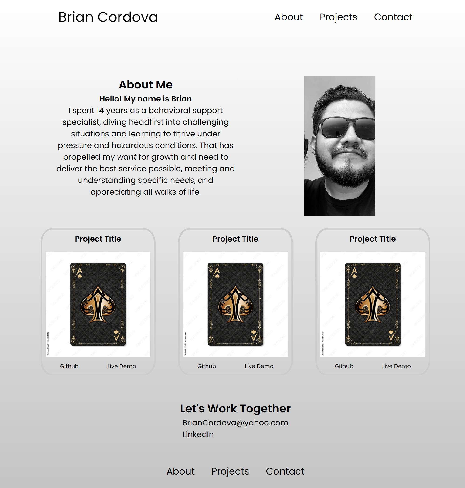

# css-portfolio

# Simple Portfolio Webpage

This is a simple portfolio webpage showcasing my projects and skills, built using only HTML and CSS.

## Features

- Responsive design using CSS media queries
- Project showcase section
- Contact form with basic validation
- Clean and minimalistic layout

## Technologies Used

- HTML5
- CSS3

## Getting Started

To view the webpage locally, simply clone the repository to your local machine and open the `index.html` file in a web browser.

## Usage

Once the webpage is open in your web browser, you can navigate through the different sections using the provided navigation links. The project showcase section provides a title for each project, along with links for Github repositories and Live Demos. The contact form can be used to reach out to me.

## Screenshots

## Links

The links to this webpage and repository can be found below:

## Credits

Stock image for card place holder can be found here:
https://stock.adobe.com/images/ace-of-spades-playing-card-vintage-style-casino-and-poker-modern-art-on-an-antique-background-black-and-gold-design-with-a-pattern/130280196

## Contact Information

For any questions or feedback, feel free to contact me at [briancordova@yahoo.com](mailto:briancordova@yahoo.com).